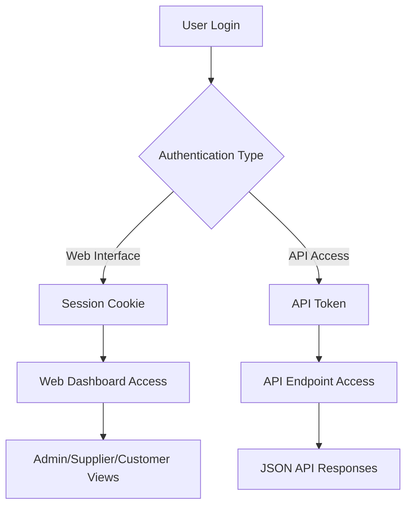

# 🔐 Laravel Sanctum Implementation in Vosiz E-commerce

## Overview
Laravel Sanctum provides API authentication for your Vosiz e-commerce platform, enabling both **session-based authentication** for your web interface and **token-based authentication** for API access.

## 🎯 How Sanctum is Used in Your Project

### 1. **Installation & Configuration**

Your project uses Sanctum with these key configurations:

```php
// config/sanctum.php
'stateful' => [
    'localhost',
    'localhost:3000', 
    '127.0.0.1',
    '127.0.0.1:8000',
    '::1'
],
'guard' => ['web'],
'expiration' => null, // Tokens don't expire
'middleware' => [
    'authenticate_session' => AuthenticateSession::class,
    'encrypt_cookies' => EncryptCookies::class,
    'validate_csrf_token' => ValidateCsrfToken::class,
]
```

### 2. **User Model Integration**

```php
// app/Models/User.php
use Laravel\Sanctum\HasApiTokens;

class User extends Authenticatable
{
    use HasApiTokens; // Enables API token functionality
    // ... other traits
}
```

## 🛡️ Authentication Patterns in Your Project

### 1. **Web Authentication (Session-based)**

Used for your main web interface (admin, customer, supplier dashboards):

```php
// routes/web.php
Route::middleware(['auth:sanctum', 'verified', 'admin'])->group(function () {
    // Admin routes
    Route::get('/admin/dashboard', [AdminDashboardController::class, 'dashboard']);
    Route::resource('/admin/products', AdminDashboardController::class);
    // ... other admin routes
});

Route::middleware(['auth:sanctum', 'verified', 'supplier'])->group(function () {
    // Supplier routes  
    Route::get('/supplier/dashboard', [SupplierController::class, 'dashboard']);
    // ... other supplier routes
});
```

**How it works:**
- Users log in via `/login` form
- Sanctum creates session cookies
- Middleware `auth:sanctum` checks session validity
- No tokens needed - traditional web authentication

### 2. **API Authentication (Token-based)**

Used for API endpoints and external integrations:

```php
// routes/api.php
Route::get('/user', function (Request $request) {
    return $request->user();
})->middleware('auth:sanctum');
```

## 🔑 Token Management Implementation

Let me show you how to implement API token features:

### 1. **Create API Tokens for Users**

```php
// In a controller method
public function createApiToken(Request $request)
{
    $request->validate([
        'name' => 'required|string|max:255',
        'abilities' => 'sometimes|array'
    ]);

    $token = $request->user()->createToken(
        $request->name,
        $request->abilities ?? ['*']
    );

    return response()->json([
        'token' => $token->plainTextToken,
        'name' => $request->name,
        'abilities' => $token->accessToken->abilities
    ]);
}
```

### 2. **Token-based API Routes**

```php
// Enhanced routes/api.php
Route::middleware('auth:sanctum')->group(function () {
    // User endpoints
    Route::get('/user', function (Request $request) {
        return $request->user();
    });
    
    // Product API for mobile app/external integrations
    Route::apiResource('/products', ProductApiController::class);
    
    // Orders API
    Route::get('/orders', function (Request $request) {
        return $request->user()->orders()->with('items')->get();
    });
    
    // Cart API
    Route::post('/cart/add', [CartController::class, 'addToCart']);
    Route::get('/cart', [CartController::class, 'getCart']);
});

// Public API endpoints (no authentication)
Route::get('/products/featured', [ProductController::class, 'featured']);
Route::get('/categories', [CategoryController::class, 'index']);
```

### 3. **Token Abilities/Scopes**

```php
// Create tokens with specific abilities
$adminToken = $user->createToken('admin-access', [
    'products:create',
    'products:read', 
    'products:update',
    'products:delete',
    'users:manage'
]);

$customerToken = $user->createToken('customer-access', [
    'products:read',
    'orders:read',
    'cart:manage'
]);

// Check abilities in middleware
Route::middleware(['auth:sanctum', 'abilities:products:create'])->group(function () {
    Route::post('/products', [ProductController::class, 'store']);
});
```

## 🛠️ Current Implementation in Your Project

### 1. **Authentication Flow**



### 2. **Middleware Stack**

Your routes use this middleware combination:

```php
[
    'auth:sanctum',              // Sanctum authentication
    'verified',                  // Email verification
    'admin'                      // Custom role middleware
]
```

### 3. **Security Features**

**CSRF Protection:**
- Enabled for stateful domains
- Automatic token validation for forms

**Session Management:**
- `AuthenticateSession` middleware prevents session hijacking
- Automatic session invalidation on password change

**Token Security:**
- Tokens can have specific abilities/scopes
- Token prefix for security scanning detection
- Configurable expiration times

## 📱 API Usage Examples

### 1. **Frontend JavaScript (SPA)**

```javascript
// Login and get CSRF token
await axios.get('/sanctum/csrf-cookie');

// Login with credentials
const response = await axios.post('/login', {
    email: 'customer@example.com',
    password: 'password'
});

// Make authenticated requests
const products = await axios.get('/api/products');
```

### 2. **Mobile App/External API**

```javascript
// Get API token
const tokenResponse = await axios.post('/api/tokens', {
    name: 'Mobile App',
    abilities: ['products:read', 'orders:read']
}, {
    headers: {
        'Authorization': 'Bearer ' + userToken
    }
});

// Use token for API calls
const headers = {
    'Authorization': 'Bearer ' + tokenResponse.data.token,
    'Accept': 'application/json'
};

const products = await axios.get('/api/products', { headers });
```

## 🔧 Advanced Sanctum Features for Your Project

### 1. **Token Management Dashboard**

Let me create a token management interface:

```php
// Add to AdminDashboardController
public function apiTokens()
{
    $tokens = auth()->user()->tokens;
    return view('admin.api-tokens', compact('tokens'));
}

public function createToken(Request $request)
{
    $request->validate([
        'name' => 'required|string|max:255',
        'abilities' => 'sometimes|array'
    ]);

    $token = $request->user()->createToken(
        $request->name,
        $request->abilities ?? ['*']
    );

    return back()->with([
        'token' => $token->plainTextToken,
        'success' => 'API token created successfully!'
    ]);
}

public function revokeToken($id)
{
    auth()->user()->tokens()->where('id', $id)->delete();
    return back()->with('success', 'Token revoked successfully!');
}
```

### 2. **API Rate Limiting**

```php
// routes/api.php
Route::middleware(['auth:sanctum', 'throttle:60,1'])->group(function () {
    // 60 requests per minute for authenticated users
    Route::apiResource('/products', ProductApiController::class);
});

Route::middleware('throttle:10,1')->group(function () {
    // 10 requests per minute for public endpoints
    Route::get('/products/featured', [ProductController::class, 'featured']);
});
```

## 🎯 Benefits in Your Vosiz Project

### 1. **Unified Authentication**
- Same system for web and API
- Consistent user experience
- Single authentication codebase

### 2. **Security**
- CSRF protection for web forms
- Token-based security for APIs
- Ability-based access control

### 3. **Flexibility**
- Support for SPA frontends
- Mobile app integration ready
- Third-party API access

### 4. **Laravel Integration**
- Works seamlessly with Jetstream
- Compatible with your MongoDB setup
- Integrates with existing middleware

## 📋 Summary

Sanctum in your Vosiz project provides:

✅ **Session authentication** for web interfaces (admin, customer, supplier dashboards)  
✅ **API token authentication** for mobile apps and external integrations  
✅ **CSRF protection** for secure form submissions  
✅ **Token abilities** for granular permission control  
✅ **Rate limiting** for API endpoint protection  
✅ **Seamless integration** with your existing Laravel architecture

Your current implementation focuses on session-based authentication for the web interface, but the foundation is ready for full API token functionality when needed for mobile apps or external integrations.