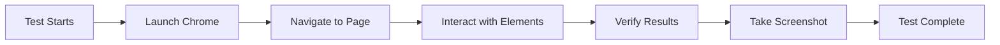

# 🚀 VOSIZ E-commerce Automated Testing Guide

## 📋 Overview

This comprehensive testing suite provides automated testing for the VOSIZ Men's Wellness E-commerce platform using:

- **PHPUnit** for unit and feature testing
- **Selenium WebDriver** for browser automation
- **Jenkins** for CI/CD pipeline
- **Docker** for containerized testing environment

## 🛠️ What You Need to Download

### 1. **Basic Requirements**
```bash
# Already installed in your project:
✅ PHP 8.2+ 
✅ Composer
✅ Node.js & NPM
✅ Laravel Framework
```

### 2. **Testing Dependencies**
```bash
# Install via Composer (will be auto-installed):
composer require --dev phpunit/phpunit
composer require --dev facebook/webdriver
composer require --dev symfony/process
```

### 3. **Selenium Server** (Choose one option):

#### Option A: Docker (Recommended)
```bash
# Install Docker Desktop from: https://www.docker.com/products/docker-desktop
# Then run:
docker run -d --name selenium-chrome -p 4444:4444 -v /dev/shm:/dev/shm selenium/standalone-chrome:latest
```

#### Option B: Standalone JAR
```bash
# Download from: https://selenium-release.storage.googleapis.com/index.html
# Get: selenium-server-standalone-4.x.x.jar
# Run: java -jar selenium-server-standalone-4.x.x.jar
```

### 4. **Jenkins** (Optional for CI/CD)
```bash
# Download from: https://www.jenkins.io/download/
# Or use Docker:
docker run -d -p 8080:8080 -p 50000:50000 jenkins/jenkins:lts
```

## 🚀 Quick Start

### Method 1: Automated Script (Recommended)

#### Windows:
```cmd
# Run the automated test script
run-tests.bat
```

#### Linux/Mac:
```bash
# Make script executable
chmod +x run-tests.sh

# Run the automated test script
./run-tests.sh
```

### Method 2: Manual Setup

1. **Install Dependencies:**
```bash
composer install --dev
npm ci && npm run build
```

2. **Start Selenium:**
```bash
docker run -d --name selenium-chrome -p 4444:4444 selenium/standalone-chrome:latest
```

3. **Start Laravel Server:**
```bash
php artisan serve --host=localhost --port=8000
```

4. **Run Tests:**
```bash
# Unit tests
vendor/bin/phpunit --testsuite=Unit

# Feature tests  
vendor/bin/phpunit --testsuite=Feature

# Functional tests (Selenium)
vendor/bin/phpunit --testsuite=Functional
```

### Method 3: Docker Environment

```bash
# Run complete testing environment
docker-compose -f docker-compose.testing.yml up --build

# Or run specific test suite
docker-compose -f docker-compose.testing.yml run test-runner
```

## 🧪 How It Works

### 1. **Test Structure**
```
tests/
├── Unit/              # PHP unit tests
├── Feature/           # Laravel feature tests  
├── Functional/        # Selenium browser tests
├── bootstrap.php      # Test environment setup
├── SeleniumTestCase.php # Base class for browser tests
├── reports/           # Test results and coverage
└── screenshots/       # Selenium screenshots
```

### 2. **Test Types Explained**

#### **Unit Tests** 🧪
- Test individual PHP classes and methods
- Fast execution (no database/browser)
- Example: Testing product price calculations

#### **Feature Tests** 🔧  
- Test Laravel application features
- Use Laravel's testing framework
- Example: Testing API endpoints, authentication

#### **Functional Tests** 🌐
- Test complete user workflows in browser
- Use Selenium WebDriver for automation
- Example: User login, product browsing, checkout

### 3. **Browser Automation Flow**



## 🤖 Jenkins Integration

### 1. **Setup Jenkins**

#### Install Jenkins:
```bash
# Docker method (easiest)
docker run -d \
  --name jenkins \
  -p 8080:8080 \
  -p 50000:50000 \
  -v jenkins_home:/var/jenkins_home \
  jenkins/jenkins:lts
```

#### Access Jenkins:
- URL: http://localhost:8080
- Get initial password: `docker exec jenkins cat /var/jenkins_home/secrets/initialAdminPassword`

### 2. **Create Jenkins Pipeline**

1. **New Item** → **Pipeline**
2. **Pipeline Definition** → **Pipeline script from SCM**
3. **SCM** → **Git**
4. **Repository URL** → Your Git repository
5. **Script Path** → `Jenkinsfile`

### 3. **Configure Jenkins Environment**

#### Install Required Plugins:
- Git Plugin
- Pipeline Plugin
- HTML Publisher Plugin
- Slack Notification Plugin (optional)

#### Set Environment Variables:
```bash
# In Jenkins → Manage Jenkins → Configure System
BASE_URL = http://localhost:8000
SELENIUM_DRIVER_URL = http://selenium:4444
MONGODB_DSN = your-mongodb-connection-string
```

### 4. **Pipeline Stages Explained**

```yaml
Pipeline Flow:
1. Checkout       # Get latest code
2. Dependencies   # Install packages
3. Environment    # Setup test environment  
4. Services       # Start app & Selenium
5. Database       # Import test data
6. Tests          # Run all test suites
7. Quality        # Code analysis
8. Performance    # Load testing
9. Reports        # Generate results
10. Cleanup       # Stop services
```

## 📊 Test Reports

### 1. **Generated Reports**
- `tests/reports/junit.xml` - JUnit format results
- `tests/reports/testdox.html` - Human-readable results
- `tests/reports/html-coverage/` - Code coverage reports
- `tests/screenshots/` - Browser screenshots

### 2. **View Results**
```bash
# Open main report
open tests/reports/test-summary.html

# View coverage
open tests/reports/html-coverage/index.html
```

## 🐛 Troubleshooting

### Common Issues:

#### 1. **Selenium Connection Failed**
```bash
# Check if Selenium is running
curl http://localhost:4444/status

# Restart Selenium
docker stop selenium-chrome
docker rm selenium-chrome
docker run -d --name selenium-chrome -p 4444:4444 selenium/standalone-chrome:latest
```

#### 2. **Laravel Server Not Starting**
```bash
# Check if port 8000 is available
netstat -an | grep 8000

# Kill existing process
lsof -ti:8000 | xargs kill -9

# Start server
php artisan serve --host=localhost --port=8000
```

#### 3. **PHPUnit Not Found**
```bash
# Install PHPUnit
composer require --dev phpunit/phpunit

# Or use full path
./vendor/bin/phpunit
```

#### 4. **Permission Issues (Linux/Mac)**
```bash
# Fix permissions
chmod -R 775 tests/reports tests/screenshots storage
```

## 🔧 Customization

### 1. **Add New Tests**

#### Unit Test Example:
```php
// tests/Unit/ProductTest.php
class ProductTest extends PHPUnit\Framework\TestCase
{
    public function testProductPriceCalculation()
    {
        $product = new Product(['price' => 100, 'discount' => 10]);
        $this->assertEquals(90, $product->getFinalPrice());
    }
}
```

#### Functional Test Example:
```php  
// tests/Functional/CheckoutTest.php
class CheckoutTest extends SeleniumTestCase
{
    public function testCompleteCheckout()
    {
        $this->visit('/products');
        $this->click('.add-to-cart');
        $this->visit('/checkout');
        $this->fillInput('#email', 'test@example.com');
        $this->click('#submit-order');
        $this->assertTextPresent('Order Confirmed');
    }
}
```

### 2. **Modify Test Configuration**

#### PHPUnit Settings:
```xml
<!-- phpunit.xml -->
<env name="BASE_URL" value="http://localhost:8000"/>
<env name="SELENIUM_DRIVER_URL" value="http://localhost:4444"/>
```

#### Jenkins Pipeline:
```groovy
// Jenkinsfile - Add custom stage
stage('Custom Tests') {
    steps {
        script {
            sh 'php artisan test:custom'
        }
    }
}
```

## 📈 Best Practices

### 1. **Test Organization**
- Keep tests small and focused
- Use descriptive test names
- Group related tests in same file
- Use setup/teardown methods

### 2. **Browser Testing**
- Always wait for elements to load
- Take screenshots on failures
- Use explicit waits over sleep()
- Test on multiple screen sizes

### 3. **CI/CD Integration**
- Run tests on every commit
- Fail builds on test failures
- Generate and archive reports
- Send notifications on failures

### 4. **Maintenance**
- Update Selenium regularly
- Keep test data current
- Review and update tests
- Monitor test execution time

## 🎯 Expected Results

When tests run successfully, you should see:

```bash
✅ Homepage loads correctly
✅ Products page displays items
✅ Category filtering works
✅ User registration functions
✅ Admin panel accessible
✅ Search functionality works
✅ Mobile responsive design
✅ Performance within limits
```

## 📞 Support

If you encounter issues:

1. Check the troubleshooting section above
2. Review test logs in `tests/reports/`
3. Check screenshots in `tests/screenshots/`
4. Verify all prerequisites are installed
5. Ensure services are running (Laravel, Selenium)

This automated testing system ensures your VOSIZ e-commerce platform maintains high quality and reliability! 🚀